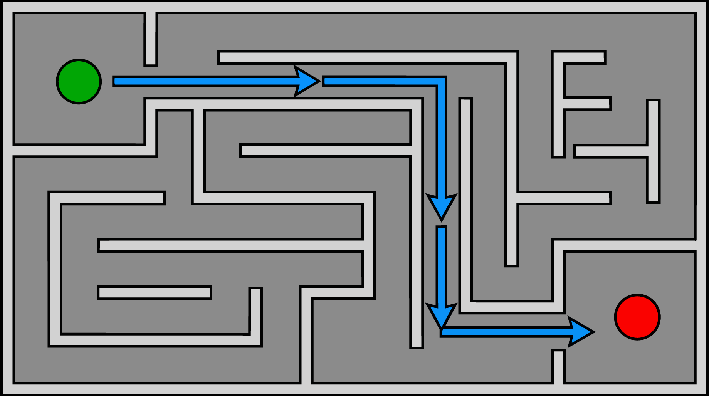

# LABERINTO 3D

Proyecto de videojuego 3D desarrollado para la asignatura de **Sistemas Inteligentes / Videojuegos**, durante el trimestre **26-O**.

---

## 1. Descripción del Proyecto

**Laberinto 3D** es un juego de exploración en tercera persona en el que el jugador debe recorrer un laberinto tridimensional, tomar decisiones en sus bifurcaciones y encontrar la salida.

El prototipo cuenta con un entorno 3D interactivo con iluminación procedural, controlador de físicas desacoplado, sistema de cámara en tercera persona contra obstáculos y una máquina de estados finitos (FSM). En la siguiente etapa se incorporarán al menos **15 agentes autónomos** que utilizarán navegación 3D (`NavigationRegion3D` y `NavigationAgent3D`) para recorrer el laberinto y alcanzar la salida de forma autónoma.

---

## 2. Integrantes y Responsabilidades

| Integrante | Responsabilidad Principal |
| :--- | :--- |
| **Daniela Campos Martínez** | Movimiento del jugador, físicas y cámara |
| **Karina Ivonne Bazán Rojas** | Diseño, iluminación y construcción del nivel |
| **Francisco Javier García Rosados** | Navegación, agentes autónomos e integración |

Todos los integrantes participan activamente en el desarrollo técnico, pruebas de rendimiento, integración y documentación.

---

## 3. Diseño Preliminar del Nivel



La imagen superior ilustra el diseño conceptual del laberinto:
- **Punto de inicio:** Panel circular iluminado en verde brillante en el sector de partida.
- **Punto de salida:** Panel circular con iluminación y bandera de llegada.
- **Estructura y Muros:** Paredes modulares con bordes biselados y franjas de energía que delimitan los pasillos y callejones sin salida.
- **Ruta de Navegación:** Línea de avance que guía la trayectoria prevista hacia la meta.

---

## 4. Tecnologías y Entorno

- **Motor:** Godot Engine 4.x (Compatible con 4.2 / 4.3 / 4.4 / 4.7)
- **Motor de Físicas:** Jolt Physics / Godot Physics 3D
- **Renderizador:** Forward+ / Direct3D 12 / Vulkan
- **Lenguaje:** GDScript
- **Sistema Operativo:** Windows 10/11
- **Control de Versiones:** Git / GitHub

---

## 5. Instrucciones de Ejecución

1. Clonar el repositorio o descargar la carpeta del proyecto:
   ```bash
   git clone https://github.com/Xavii-rod03/Juego3D.git
   ```
2. Abrir **Godot Engine 4.x**.
3. Hacer clic en **Importar** (Import) y seleccionar el archivo `project.godot`.
4. Pulsar **Importar y Editar**.
5. Presionar **F5** para ejecutar el proyecto (la escena principal configurada es `res://scenes/level.tscn`).

### Controles en el Juego:
| Tecla / Entrada | Acción |
| :--- | :--- |
| **W, A, S, D** | Movimiento del personaje relativo a la vista de la cámara |
| **Movimiento del Ratón** | Control orbital de la cámara (Yaw y Pitch) |
| **ESPACIO** | Salto vertical (únicamente disponible si el personaje está en el suelo) |
| **ESCAPE** | Alternar modo de captura del cursor (visible / capturado) |
| **R** | Reiniciar nivel de forma instantánea |
| **F1** | Alternar límites de FPS (**Ilimitado $\rightarrow$ 30 FPS $\rightarrow$ 60 FPS**) para verificar consistencia física |

---

## 6. Estructura del Repositorio

```text
Juego3D/
├── .gitignore                        # Reglas de exclusión para caché de Godot (.godot/)
├── icon.svg                          # Ícono del proyecto
├── project.godot                     # Configuración general, inputs y motor Jolt
├── Juego.png                         # Esquema de diseño preliminar del nivel
├── PROMPT_MODELADO_3D.md             # Bitácora y prompt para generación 3D con IA
├── DOCUMENTO_REPORTE_PDF.md          # Documento formal listo para exportar a PDF (4 a 6 páginas)
├── Prompts/
│   ├── bitacora_prompts.md           # Registro técnico detallado de generación con IA
│   └── prompt_modelado_3D.md         # Ficha técnica y verificaciones del modelo
├── scenes/
│   ├── level.tscn                    # Escena de nivel (suelo, iluminación, obstáculos, cielo, props)
│   ├── player.tscn                   # Controlador del jugador (CharacterBody3D, SpringArm3D)
│   ├── character_model.tscn          # Escena envolvente del modelo 3D (desacoplada)
│   └── hud.tscn                      # Interfaz gráfica CanvasLayer con telemetría y FSM
├── scripts/
│   ├── player.gd                     # Controlador cinemático, FSM y movimiento relativo
│   └── hud.gd                        # Script del HUD y conmutador de límites de cuadros
└── shaders/
    └── grid_floor.gdshader           # Shader procedural de cuadrícula métrica para el suelo
```

---

## 7. Arquitectura y Controlador del Personaje (Tarea 1)

### 7.1. Separación de Física (`_physics_process`) y Visualización (`_process`)
El proyecto separa estrictamente la simulación matemática de la presentación visual:
- **`_physics_process(delta)`**: Opera a frecuencia fija ($60\text{ Hz}$). Lee las entradas del teclado, proyecta el vector en el plano horizontal $XZ$, calcula la gravedad, interpola la velocidad con fricción/aceleración y ejecuta `move_and_slide()`.
- **`_process(delta)`**: Opera con cada fotograma de renderizado. Interpola suavemente la rotación del avatar visual hacia el vector de avance mediante `lerp_angle()`, garantizando giros fluidos sin vibraciones (*jitter*).

### 7.2. Uso Riguroso de `delta` y Prevención del "Doble Tiempo"
- **Aceleración gravitatoria:** La gravedad se aplica multiplicando por delta ($\text{velocity.y} \mathrel{-}= g \cdot \Delta t$) porque es una aceleración ($m/s^2$) que modifica la velocidad ($m/s$).
- **Integración en `move_and_slide()`:** En Godot 4.x, la función nativa `move_and_slide()` toma directamente el vector `velocity` del `CharacterBody3D` y aplica internamente la multiplicación por el delta de física ($\Delta x = v \cdot \Delta t$). **No se debe multiplicar la velocidad por delta al llamar a `move_and_slide()`**, ya que de lo contrario se aplicaría el tiempo dos veces ($\Delta x = v \cdot \Delta t^2$), congelando el personaje.

### 7.3. Movimiento Relativo a la Cámara
El vector de movimiento se proyecta sobre el plano horizontal $XZ$ utilizando la orientación (`basis`) del pivote de la cámara:
```gdscript
var cam_transform = camera_pivot.global_transform
var forward = -cam_transform.basis.z
var right = cam_transform.basis.x
forward.y = 0.0; right.y = 0.0
move_direction = (right.normalized() * input_dir.x + forward.normalized() * -input_dir.y).normalized()
```

### 7.4. Tratamiento de Paredes con `SpringArm3D`
Para evitar que la cámara atraviese las paredes o esquinas del laberinto:
- Se implementó un `SpringArm3D` nativo de $3.5\text{ m}$ de longitud con margen de $0.2\text{ m}$.
- La máscara de colisión está en la Capa 1 (entorno) y excluye la Capa 2 (jugador).
- Al aproximarse a una pared, el rayo acorta automáticamente la distancia, evitando que la cámara haga *clipping* a través de la geometría.

---

## 8. Máquina de Estados Finitos (FSM)

El controlador implementa tres estados explícitos: `IDLE`, `WALK` y `JUMP`.

```text
       +--------------+
       |     IDLE     |<---------------+
       +--------------+                |
          |        ^                   |
(vel > 0) |        | (vel == 0)        |
          v        |                   |
       +--------------+                | (toca suelo)
       |     WALK     |                |
       +--------------+                |
          |        |                   |
 (!suelo) |        | (!suelo)          |
          v        v                   |
       +--------------+                |
       |     JUMP     |----------------+
       +--------------+
```

- Cada transición pasa por `_transition_to(new_state)`, la cual emite la señal `state_changed` y produce un registro legible en la consola:
  ```text
  [FSM] Transición explícita: IDLE -> WALK (Sobre suelo: true, VelY: 0.00)
  [FSM] Transición explícita: WALK -> JUMP (Sobre suelo: false, VelY: 5.50)
  ```
- El panel HUD en pantalla actualiza en vivo el texto y color del estado (**Verde:** IDLE, **Azul:** WALK, **Naranja:** JUMP).

---

## 9. Modelado con IA y Escena Envolvente

- **Prompt utilizado:** Ver archivo completo en [`PROMPT_MODELADO_3D.md`](PROMPT_MODELADO_3D.md).
- **Ficha Técnica:** 3,120 triángulos, 1,624 vértices, 1 material PBR (`StandardMaterial3D`), textura $1024 \times 1024$, escala humana de $1.80\text{ m}$ y normales exteriores corregidas.
- **Escena Envolvente:** El modelo se encuentra aislado en `res://scenes/character_model.tscn` dentro de `VisualWrapper`, desacoplando completamente la malla gráfica de las físicas del personaje.

---

## 10. Pruebas de Aceptación Verificadas

1. **Colisiones y Salto:** El personaje colisiona adecuadamente contra muros, esquinas y plataformas sin atravesarlas. El salto solo se ejecuta sobre el suelo (`is_on_floor() == true`).
2. **Giro de Cámara:** Al rotar la cámara junto a esquinas y paredes, el `SpringArm3D` se contrae impidiendo que la cámara atraviese los muros.
3. **Consistencia de FPS:** Al alternar los límites con **F1** entre 30 FPS y 60 FPS, la velocidad horizontal y la distancia recorrida se mantienen constantes gracias al uso correcto de `delta`.
4. **Integridad del Proyecto:** El proyecto abre limpiamente sin referencias rotas ni dependencias faltantes.
