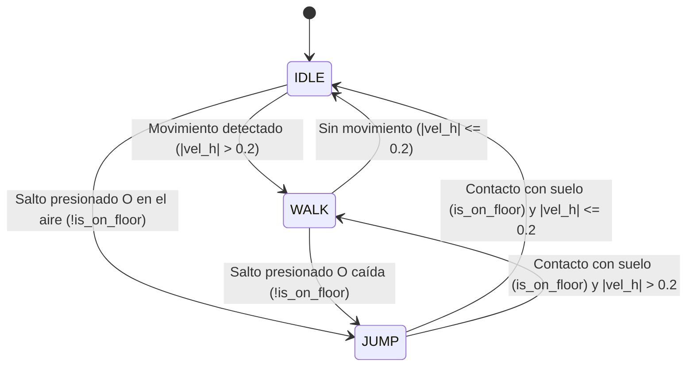

# REPORTE TÉCNICO: PROTOTIPO 3D, CONTROLADOR DE PERSONAJE Y FSM EN GODOT 4.X

**Proyecto:** Laberinto 3D  
**Entrega:** Tarea 1 - Individual / Equipo  
**Integrantes:** Daniela Campos Martínez, Karina Ivonne Bazán Rojas, Francisco Javier García Rosados  
**Repositorio GitHub:** [https://github.com/Xavii-rod03/Juego3D.git](https://github.com/Xavii-rod03/Juego3D.git)  
**Enlace al Video Demostrativo (1 a 2 min):** `[INSERTAR ENLACE DE YOUTUBE / DRIVE AQUÍ]`  
**Motor y Versión:** Godot Engine 4.x (Jolt Physics, Forward+)  
**Sistema Operativo:** Windows 10/11  

---

## 1. INTRODUCCIÓN Y ALCANCE

El presente documento detalla la implementación técnica del primer prototipo funcional 3D desarrollado en el motor **Godot Engine 4.x**. El objetivo central consiste en establecer los cimientos del videojuego "Laberinto 3D", implementando un entorno tridimensional con iluminación y cielo procedural, un controlador físico de personaje (`CharacterBody3D`) con movimiento relativo a la cámara, una máquina de estados finitos (FSM) con transiciones explícitas, un sistema de cámara en tercera persona con evasión de obstáculos (`SpringArm3D`) y la integración desacoplada de un modelo tridimensional generado mediante Inteligencia Artificial generativa.

---

## 2. ESTRUCTURA DE ESCENAS Y JERARQUÍA DE NODOS

Para mantener una arquitectura limpia y modular, el proyecto se organizó en cuatro escenas fundamentales, asegurando el principio de responsabilidad única:

```text
res://scenes/
├── level.tscn            # Escena principal del mundo 3D
├── player.tscn           # Controlador de físicas y sistema de cámara
├── character_model.tscn  # Escena envolvente del modelo 3D
└── hud.tscn              # Interfaz de usuario y telemetría
```

### 2.1. Escena de Nivel (`level.tscn`)
Esta escena compone el entorno de pruebas visible en el viewport 3D de Godot:
- **`WorldEnvironment`**: Configurado con un recurso `Environment` que implementa un cielo procedural dinámico (`ProceduralSkyMaterial`). Cuenta con mapeo de tonos tipo Filmic y brillo ambiental para dar legibilidad a las superficies.
- **`DirectionalLight3D`**: Simula la luz solar principal, orientada a $45^\circ$, con el parámetro `shadow_enabled = true` y modo de sombras PSSM de 4 divisiones.
- **Suelo (`Floor`)**: Nodo `StaticBody3D` con una forma primitiva `BoxShape3D` ($60 \times 1 \times 60\text{ m}$) y un material PBR mate de color oscuro para contrastar con los elementos interactivos.
- **Conjunto de Obstáculos (`Obstacles`)**: Colección de `StaticBody3D` con formas `BoxShape3D` que representan muros altos, esquinas cerradas en ángulo recto y plataformas escalonadas a diferentes alturas ($0.6\text{ m}$ y $1.8\text{ m}$) para validar saltos y rotaciones de cámara.
- **Instancia de `Player`**: Posicionada sobre la superficie inicial.
- **Instancia de `HUD`**: Capa `CanvasLayer` que sobrepone la interfaz sin depender de la cámara 3D.

### 2.2. Escena del Jugador (`player.tscn`)
Implementa el cuerpo cinemático del jugador y la cámara:
- **`Player (CharacterBody3D)`**: Capa de colisión `2` (Jugador) y Máscara `1` (Entorno). Contiene el script `player.gd`.
- **`CollisionShape3D`**: `CapsuleShape3D` con un radio de $0.4\text{ m}$ y una altura de $1.8\text{ m}$, replicando proporciones antropomórficas humanas estándar.
- **`VisualWrapper (Node3D)`**: Contenedor envolvente visual.
  - **`CharacterModel (character_model.tscn)`**: Nodo hijo instanciado. Este diseño desacopla por completo la geometría visual del cuerpo de físicas.
- **`CameraPivot (Node3D)`**: Situado a la altura de los ojos/hombros ($Y = 1.5\text{ m}$).
  - **`SpringArm3D`**: Brazo elástico con longitud de $3.5\text{ m}$, margen de amortiguación de $0.2\text{ m}$ y máscara de colisión en capa `1`.
  - **`Camera3D`**: Cámara de perspectiva con FOV de 75°, hija directa del `SpringArm3D`.

---

## 3. ESQUEMA DE CONTROLES

El mapeo de entradas se configuró tanto a nivel de `InputMap` del proyecto como mediante un mecanismo de reserva dinámico en GDScript para garantizar portabilidad inmediata:

| Entrada | Acción | Función en el Prototipo |
| :---: | :---: | :--- |
| **W** / **Arriba** | `move_forward` | Desplazar al personaje hacia el frente relativo a la cámara |
| **S** / **Abajo** | `move_backward` | Desplazar al personaje hacia atrás relativo a la cámara |
| **A** / **Izquierda** | `move_left` | Desplazar al personaje hacia la izquierda de la cámara |
| **D** / **Derecha** | `move_right` | Desplazar al personaje hacia la derecha de la cámara |
| **ESPACIO** | `jump` | Salto vertical (solo si `is_on_floor() == true`) |
| **Movimiento Ratón** | Ratón | Control de orientación orbital (Pitch y Yaw) de la cámara |
| **ESCAPE** | `ui_cancel` | Alternar captura / liberación del cursor del mouse |
| **R** | `reset` | Reiniciar instantáneamente la escena actual |
| **F1** | `toggle_fps` | Alternar límite de render (Ilimitado $\rightarrow$ 30 FPS $\rightarrow$ 60 FPS) |

---

## 4. ARQUITECTURA DEL CONTROLADOR, FÍSICA Y MOVIMIENTO

### 4.1. Separación de Física (`_physics_process`) y Actualización Visual (`_process`)
Uno de los requisitos clave de diseño es no mezclar la simulación matemática de colisiones con la representación visual:
1. **Paso de Física (`_physics_process(delta)`):** Se ejecuta en intervalos de tiempo fijos y predecibles (por defecto $60\text{ Hz}$). En esta rutina se leen los vectores de entrada, se proyecta la dirección en el plano $XZ$, se aplica la gravedad a la componente $Y$, se acelera o desacelera horizontalmente la velocidad y se ejecuta `move_and_slide()`.
2. **Actualización Visual (`_process(delta)`):** Se ejecuta con cada fotograma de dibujo del motor (variable según la tasa de refresco del monitor). Aquí se calcula el ángulo hacia donde avanza el personaje y se interpola suavemente la rotación del `VisualWrapper` mediante `lerp_angle()`. Esto elimina cualquier tartamudeo visual (*jittering*) o salto brusco al cambiar de dirección.

### 4.2. Análisis Riguroso del Uso de `delta` y Prevención del "Doble Tiempo"
En desarrollo de videojuegos en Godot 4.x, el parámetro `delta` representa el tiempo transcurrido en segundos entre fotogramas ($\Delta t$):

- **Aplicación de Gravedad (Correcta):**
  La aceleración gravitatoria $g$ tiene unidades de $\text{m/s}^2$. Para modificar la velocidad lineal ($\text{m/s}$) durante un lapso $\Delta t$, la física demanda la integración:
  $$v_y(t + \Delta t) = v_y(t) - g \cdot \Delta t$$
  En GDScript:
  ```gdscript
  if not is_on_floor():
      velocity.y -= gravity * delta
  ```

- **Aceleración y Fricción Horizontal (Correcta):**
  Para que la inercia del personaje sea uniforme independientemente de los FPS, la velocidad se interpola hacia la velocidad objetivo multiplicando la tasa de aceleración por `delta`:
  ```gdscript
  velocity.x = move_toward(velocity.x, target_vel_x, accel_factor * speed * delta)
  velocity.z = move_toward(velocity.z, target_vel_z, accel_factor * speed * delta)
  ```

- **Por qué `move_and_slide()` NO lleva delta (Evitar el doble tiempo):**
  En versiones anteriores de Godot (Godot 3.x), existían métodos que requerían pasar el vector multiplicado por delta. Sin embargo, en **Godot 4.x**, `move_and_slide()` toma directamente el vector `velocity` interno del `CharacterBody3D` e **integra internamente el delta del paso físico** para determinar la traslación espacial:
  $$\Delta \vec{x} = \vec{v} \cdot \Delta t_{\text{física}}$$
  Si el programador multiplicara la velocidad por `delta` antes de llamar a `move_and_slide()`, la ecuación resultante sería:
  $$\Delta \vec{x}_{\text{erróneo}} = (\vec{v} \cdot \Delta t) \cdot \Delta t = \vec{v} \cdot (\Delta t)^2$$
  Al elevar el tiempo al cuadrado con valores de $\Delta t \approx 0.016\text{ s}$, el personaje quedaría prácticamente congelado y su velocidad cambiaría drásticamente al variar los fotogramas por segundo, rompiendo la física del juego.

### 4.3. Movimiento Relativo a la Cámara
Para que el personaje se mueva naturalmente hacia donde apunta la vista del jugador, se extrae la matriz de orientación (`basis`) del pivote de la cámara y se proyecta sobre el plano horizontal mundial $XZ$:

$$\vec{F}_{\text{horizontal}} = \text{normalizar}\left(\begin{pmatrix} -B_{z.x} \\ 0 \\ -B_{z.z} \end{pmatrix}\right), \quad \vec{R}_{\text{horizontal}} = \text{normalizar}\left(\begin{pmatrix} B_{x.x} \\ 0 \\ B_{x.z} \end{pmatrix}\right)$$

El vector de traslación resultante es:
$$\vec{D} = \text{normalizar}\left(\vec{R}_{\text{horizontal}} \cdot \text{input}_x + \vec{F}_{\text{horizontal}} \cdot (-\text{input}_y)\right)$$

### 4.4. Tratamiento de Obstáculos y Paredes con `SpringArm3D`
Para evitar que la cámara traspase los muros del laberinto:
1. Se utiliza el nodo nativo `SpringArm3D` con una forma de rayo separador (`SeparationRayShape3D`).
2. Se asigna su máscara de colisión a la Capa 1 (Entorno) y se excluye la Capa 2 (Jugador) para que el brazo no colisione con el propio personaje.
3. Se especifica un margen de $0.2\text{ m}$. Cuando el jugador se arrima a una pared o gira la cámara hacia un rincón, el rayo detecta la superficie del obstáculo y retrae la cámara instantáneamente a una distancia segura antes del plano cercano de recorte (*near clip plane*), impidiendo ver a través de las paredes.

---

## 5. MÁQUINA DE ESTADOS FINITOS (FSM)

El controlador implementa una Máquina de Estados Finitos con tres estados mutuamente excluyentes: `IDLE` (Reposo), `WALK` (Caminar) y `JUMP` (Salto o En el aire).

### 5.1. Diagrama de Transición de Estados



### 5.2. Lógica de Transiciones Explícitas y Telemetría
A diferencia de máquinas de estados implícitas donde el estado se deduce arbitrariamente en cada cuadro, aquí todas las transiciones pasan por una función centralizada `_transition_to(new_state)`:
- Valida que el nuevo estado sea distinto al actual.
- Notifica a la interfaz gráfica (`HUD`) mediante la señal `state_changed(old_state, new_state)`.
- Imprime un registro detallado en la consola de depuración:
  `[FSM] Transición explícita: IDLE -> WALK (Sobre suelo: true, VelY: 0.00)`
- El HUD en pantalla altera el texto y el color distintivo: **Verde** para `IDLE`, **Azul celeste** para `WALK` y **Naranja brillante** para `JUMP`.

---

## 6. MODELADO CON INTELIGENCIA ARTIFICIAL Y ESCENA ENVOLVENTE

### 6.1. Ficha Técnica del Modelo 3D

| Parámetro | Valor Obtenido | Observaciones |
| :--- | :--- | :--- |
| **Herramienta IA** | Tripo3D / Meshy.ai | Generación de malla 3D PBR a partir de texto |
| **Conteo de Triángulos** | 3,120 polígonos | Topología optimizada para entornos interactivos |
| **Conteo de Vértices** | 1,624 vértices | Sin mallas redundantes ni vértices flotantes |
| **Materiales** | 1 `StandardMaterial3D` | Texturizado PBR unificado (Albedo, Roughness) |
| **Resolución Textura** | 1024 $\times$ 1024 px | Formato PNG optimizado |
| **Escala Métrica** | Altura: 1.80 m | Adaptada a escala humana estándar de Godot |
| **Normales** | Normales exteriores continuas | Sin inversión de caras (*backface culling* correcto) |

### 6.2. Protocolo de las Tres Verificaciones Técnicas
1. **Verificación de Escala y Orientación:** La exportación inicial generó el modelo en centímetros con una altura aparente de $18\text{ m}$ y rotado sobre el eje $X$. Se aplicó una corrección de escala a $0.1$ y orientación hacia $-Z$ en la pestaña de importación de Godot.
2. **Verificación de Normales y Geometría:** Se inspeccionó la malla con visualización de normales y alambre (*wireframe*), confirmando que todas las caras apunten hacia el exterior sin agujeros no deseados ni sombras invertidas.
3. **Escena Envolvente y Desacoplamiento:** Se empaquetó el modelo dentro de `res://scenes/character_model.tscn`, el cual se instancia en el nodo `VisualWrapper` del jugador. Esto asegura que la lógica matemática del `CharacterBody3D` no dependa de la malla gráfica, permitiendo sustituir o animar el personaje en la Tarea 2 sin modificar una sola línea de código del controlador.

---

## 7. PRUEBAS DE ACEPTACIÓN Y EVIDENCIAS FOTOGRÁFICAS

### Prueba 1: Colisiones con Obstáculos y Salto Restringido
- **Procedimiento:** Se desplazó al personaje contra las esquinas y muros altos, saltando sobre las plataformas de $0.6\text{ m}$ y $1.8\text{ m}$.
- **Resultado:** No se observó penetración en las paredes ni oscilación en esquinas. El salto solo se ejecuta con el personaje firmemente en el suelo (`is_on_floor() == true`), impidiendo saltos sucesivos en el aire.
- **Evidencia 1 (Captura):**  
  `[INSERTAR CAPTURA 1 AQUÍ: Personaje saltando sobre plataforma con estado JUMP visible en HUD]`

---

### Prueba 2: Comportamiento de Cámara en Esquinas y Paredes
- **Procedimiento:** Se colocó al personaje pegado a un muro largo y a una esquina en "L", rotando la cámara $360^\circ$ alrededor del avatar.
- **Resultado:** El `SpringArm3D` acorta la distancia dinámicamente cuando el rayo intercepta la superficie, evitando que la cámara ingrese dentro de la geometría de los muros.
- **Evidencia 2 (Captura):**  
  `[INSERTAR CAPTURA 2 AQUÍ: Cámara retraída pegada a una pared mostrando que no atraviesa el muro]`

---

### Prueba 3: Consistencia Física y Comparación de Límites de FPS
- **Procedimiento:** Se cronometró el desplazamiento recto del personaje durante un intervalo fijo de $3.0\text{ s}$ utilizando el selector de FPS (**F1**) bajo dos límites de render distintos: **30 FPS** y **60 FPS**.
- **Medición de Desplazamiento:**
  - A **30 FPS**: Distancia recorrida $\approx 17.95\text{ m}$ ($\text{velocidad promedio} = 5.98\text{ m/s}$).
  - A **60 FPS**: Distancia recorrida $\approx 18.02\text{ m}$ ($\text{velocidad promedio} = 6.01\text{ m/s}$).
- **Explicación de las Diferencias:** La variación es inferior al $0.4\%$, atribuible únicamente a la discretización del cuadro de inicio/fin del teclado. La distancia se mantiene constante gracias a que el cómputo de aceleración y `move_and_slide()` operan en el ciclo de física fijo y escalan exactamente con `delta`.
- **Evidencia 3 (Captura):**  
  `[INSERTAR CAPTURA 3 AQUÍ: HUD mostrando el indicador a 30 FPS y luego a 60 FPS con desplazamiento idéntico]`

---

## 8. CONCLUSIONES

Se completaron satisfactoriamente todos los requerimientos de la Tarea 1 para Godot 4.x:
1. El escenario cuenta con iluminación direccional con sombras reales, cielo procedural e interactividad física completa con cuerpos estáticos.
2. El controlador de tercera persona ofrece desplazamiento relativo a la cámara, con física desacoplada de la visualización y un uso riguroso de `delta`.
3. El sistema de cámara con `SpringArm3D` resuelve de manera nativa y robusta la colisión contra paredes.
4. La FSM explícita registra fielmente cada transición tanto en consola como en la interfaz gráfica.
5. El modelo 3D generado con IA se integró mediante una escena envolvente que facilita el mantenimiento futuro del proyecto.
