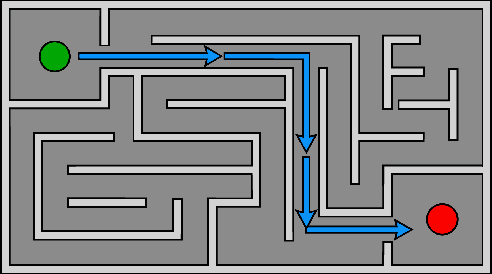

# Juego3D
# LABERINTO 3D

Proyecto de videojuego 3D desarrollado para la asignatura **[Nombre de la asignatura]**, durante el trimestre **26-O**.

## 1. Descripción

**Laberinto 3D** es un juego de exploración en tercera persona en el que el jugador debe recorrer un laberinto, tomar decisiones en sus bifurcaciones y encontrar la salida.

El prototipo contará con un nivel principal. En la versión correspondiente del proyecto se incorporarán al menos **15 agentes autónomos** que deberán desplazarse por el laberinto y encontrar la salida.

## 2. Integrantes y responsabilidades

| Integrante | Responsabilidad principal |
|---|---|
| [Nombre 1] | Movimiento del jugador y cámara |
| [Nombre 2] | Diseño y construcción del nivel |
| [Nombre 3] | Navegación y agentes autónomos |

Todos los integrantes participarán en el desarrollo técnico, las pruebas, la integración y la corrección de errores.

## 3. Tecnologías

- **Motor:** Godot 4.x
- **Lenguaje:** GDScript
- **Sistema operativo:** Windows
- **Control de versiones:** Git
- **Repositorio:** GitHub

## 4. Estructura del repositorio

```text
Laberinto3D/
├── README.md
├── documentation/
├── scenes/
├── scripts/
├── assets/
└── tests/
```

- `documentation/`: documentos y diseños del proyecto.
- `scenes/`: escenas del juego.
- `scripts/`: scripts en GDScript.
- `assets/`: recursos visuales y otros elementos.
- `tests/`: pruebas del proyecto y de rendimiento.

## 5. Organización del trabajo

Se utilizarán ramas de Git para cada integrante:

```text
main
├── feature/javi
├── feature/ivonne
└── feature/daniela
```

La rama `main` contendrá las versiones integradas del proyecto. Cada integrante trabajará principalmente en su rama correspondiente y los cambios importantes serán revisados antes de integrarse.

Todos los integrantes participarán en la revisión, pruebas y solución de problemas del proyecto.


## Diseño preliminar del nivel


La imagen muestra el diseño en vista superior de un laberinto o nivel de videojuego, con un estilo visual moderno y texturas que simulan metal y piedra.

### Elementos principales

- **Punto de inicio:** Panel circular iluminado en color verde brillante, ubicado en la esquina superior izquierda.
- **Punto de salida:** Panel circular con iluminación roja y el ícono de una bandera de cuadros, situado en la esquina inferior derecha.
- **Estructura:** Paredes grises con bordes biselados que forman los pasillos y obstáculos del laberinto, creando un efecto tridimensional.
- **Ruta:** Línea de energía azul luminosa con flechas direccionales que muestra un posible camino desde el punto de inicio hasta la salida.

